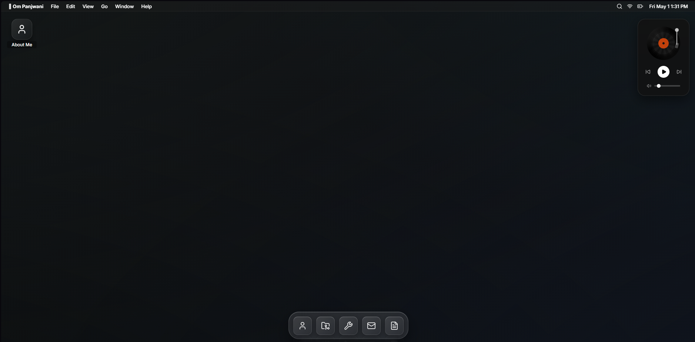
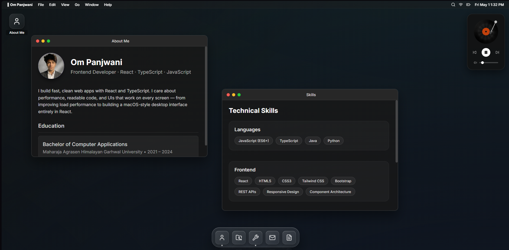

# macOS-Style Personal Portfolio

A personal portfolio built with React that mimics the macOS desktop experience,
complete with a functional dock, draggable windows, and built-in apps to showcase
my work, skills, and background.

## Live Site

[ompanjwani.vercel.app](https://ompanjwani.vercel.app)

## Tech Stack

- **Frontend:** React 19, Framer Motion
- **Icons:** Lucide React
- **PDF Rendering:** PDF.js
- **Build Tool:** Vite
- **Styling:** Vanilla CSS (glassmorphism aesthetic)

## Features

- **Desktop Environment:** Animated background with interactive desktop icons
- **Window Management:** Open, focus, drag, and close multiple windows simultaneously
- **Dock:** Responsive, animated dock for quick app access
- **Resume Viewer:** In-browser PDF viewer with zoom controls
- **Music Player:** Persistent audio player with rotating vinyl animation
- **Top Bar:** System-style bar showing live date/time and status indicators

## Screenshots

### Homepage


### Apps View


## Setup & Installation

1. Clone the repository:
```bash
   git clone https://github.com/panjwaniom/Portfolio.git
```

2. Install dependencies:
```bash
   npm install
```

3. Start the development server:
```bash
   npm run dev
```
   Available at `http://localhost:5173`

```bash
npm run build     # Production build
```

> No API keys or environment variables required.

## Roadmap

- Light mode and customizable accent colors
- Sidebar widget system (weather, calendar)
- Wallpaper selection with dynamic and static options
- Multi-track music player with playlist support
